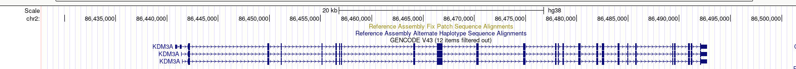
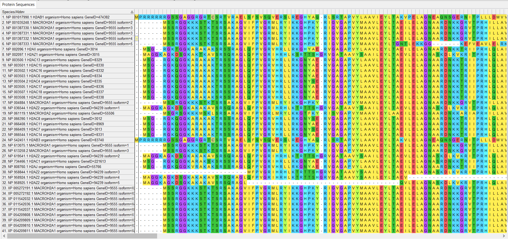
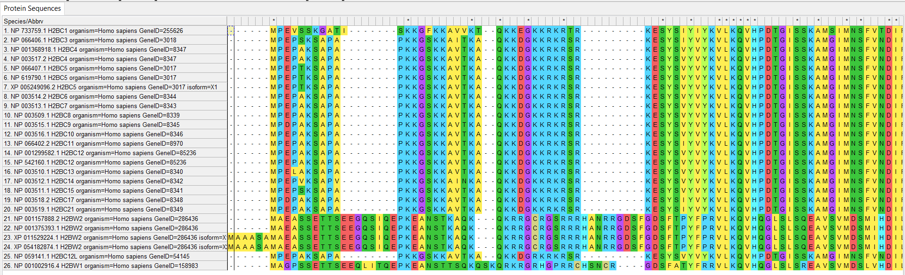
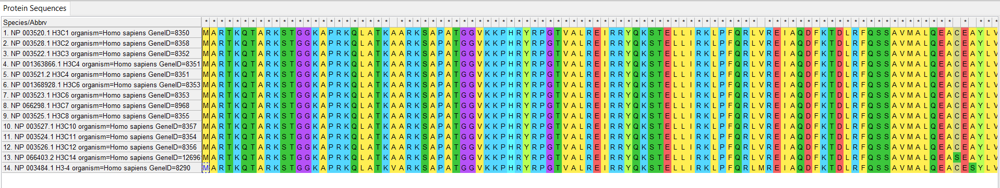
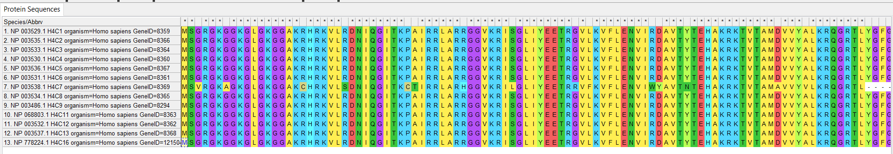
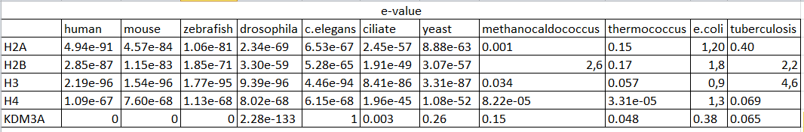
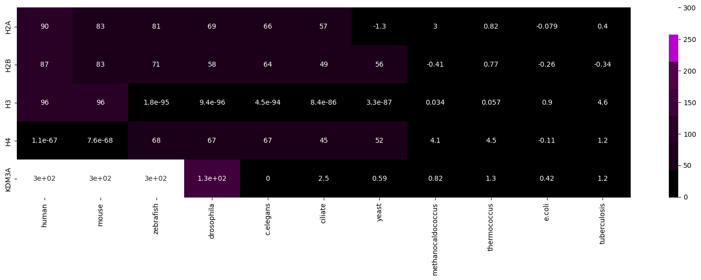

# ВШЭ Майнор Биоинформатика индивидуальный проект 
## Ген KDM3A
Эпигенетическая функция: Histone modification erase     
Эпигенетическая группа: H3K9me      
      
Статьи:     
1. [KDM3A and KMD3B catalyze the demethylation of transcriptionally repressive mono- and di-methylated histone H3 lysine 9 (H3K9me1/me2) in vitro and in vivo with a preference for dimethylated residues, thereby mediating transcriptional activation](https://www.ncbi.nlm.nih.gov/pmc/articles/PMC7280979/)      
2. [Deregulation of histone demethylase KDM3a, an important regulator for H3K9 methylation, is correlated with obesity and abnormal metabolism in rodent models. ](https://pubmed.ncbi.nlm.nih.gov/28135625/)    
     

## Выравнивание гистонов
|Название | Скрин | Вывод |
|:-:|:-:|:-|
|H2A||Между последовательностями есть небольшие различия, скорее всего, это связано с мутациями и полиморфизмом|
|H2B||Между последовательностями есть небольшие различия, скорее всего, это связано с мутациями и полиморфизмом|
|H3||Между последовательностями практически нет различий, гены являются копиями|
|H4||Между последовательностями практически нет различий, гены являются копиями|
        
## e-value
     
Пример бласт запроса:

    blastp  -query YOUR_PROTEIN.fasta  -db /mnt/storage/project_2023/proteomes/drosophila.faa  -out drosophila.blast  -outfmt 7    
    
## -log(e-value)
.png)
## Тепловая карта
     

[Код создания тепловой карты](https://colab.research.google.com/drive/17DBDYY8xb1yw4W62kSZdugkq3V1GYmnF?usp=sharing)     
     
Выбранный белок гена HR эволюционно начал появляться у многоклеточных беспозвоночных организмов (drosophila). И есть уже у всех исследуемых многоклеточных позвоночных (human, mouse, zebrafish).
Также подтверждается связь с H3 семейством гистонов.
